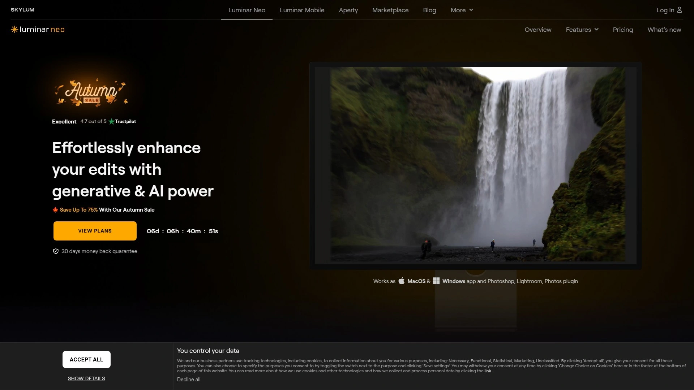

# 2025's Top 10 Best AI Photo Editing Tools

Every second counts when you're managing product photos, social media content, or creative projects. Dragging images into Photoshop and manually selecting pixels for hours doesn't make sense anymore. AI background removers and photo editors now handle what used to take 30 minutes in under 3 seconds—letting you focus on strategy instead of tedious clicking. Whether you need transparent PNGs for ecommerce listings or polished visuals for campaigns, these tools deliver professional results without the professional learning curve.

## **[Cutout.Pro](https://www.cutout.pro)**

Complete visual content toolkit handling everything from background removal to video editing through powerful computer vision.

Cutout.Pro built their platform around one idea: make complex photo and video editing accessible without sacrificing quality. Their AI processes images in under five seconds, whether you're removing backgrounds, enhancing old photos, or creating professional product shots.

The background removal tool works across any subject type—people, products, animals, vehicles. Upload an image and the neural networks trained on millions of photos automatically detect edges and separate subjects from backgrounds, even handling tricky details like hair and transparent objects. Download results as PNG with transparency or swap in new backgrounds instantly.

**What sets it apart:** Beyond basic background removal, Cutout.Pro includes photo restoration for damaged or faded images, automatic colorization for black-and-white photos, image upscaling to improve resolution, and video background removal without green screens. The batch processing feature handles dozens of images simultaneously, crucial when you're preparing entire product catalogs.

Ecommerce sellers use it to create consistent white-background listings. Print-on-demand businesses leverage the face cutout and cartoonizer for custom products. Photographers batch-edit backgrounds instead of spending nights on manual work. Content creators remove video backgrounds for announcements and promos without complicated setups.

The API integration lets developers embed these capabilities directly into apps with minimal code. Process massive volumes of images or videos through automated workflows. Customize outputs, adjust quality settings, and maintain brand consistency across all visual assets.

Pricing stays reasonable with free trials available. Paid plans unlock higher resolution exports, remove watermarks, and increase monthly processing limits. For teams managing high volumes, the time saved pays for itself quickly—one user reported 47% sales increase after integrating Cutout.Pro's technology for product customization.

The platform works entirely through web browsers, meaning no software installation or device compatibility issues. Edit on desktop, mobile, or tablet with identical results. Updates and improvements roll out automatically without disrupting workflows.

***

## **[Remove.bg](https://www.remove.bg)**

Industry-standard background remover processing over 100 million images with plug-and-play integrations.

Remove.bg does one thing exceptionally well: removes backgrounds from images in five seconds flat. Upload a photo, watch the background disappear, download your transparent PNG. The simplicity hides sophisticated AI trained on massive datasets to handle everything from simple product shots to complex portraits with flyaway hair.

The tool automatically detects subjects and separates them from backgrounds with remarkable precision. Works on people, products, animals, cars—anything with defined edges. Even challenging scenarios like fur, fine jewelry, transparent glass, and intricate patterns get processed accurately.

After removal, you choose what happens next. Keep the transparent background for layering into designs, add a solid color for clean product photos, or upload your own background image to create custom scenes. The Magic Background feature generates AI backgrounds matching your subject without writing prompts.

**Processing power:** Bulk editing handles up to 500 images per minute through the desktop app. The API integrates directly into existing workflows—connect with Figma, Photoshop, GIMP, Shopify, Make, Zapier, and thousands of other tools. Set it up once and background removal happens automatically as part of your production pipeline.

Free users get unlimited low-resolution previews with one credit for full-resolution downloads. Paid plans offer credits or subscriptions depending on volume needs. Pricing sits at $0.18 per image on subscription or $0.90 pay-as-you-go.

The browser extension adds background removal directly to your workflow wherever you browse. Mobile apps let you edit on-the-go. Every output maintains up to 50 megapixel resolution, ensuring quality stays pristine even for large prints or detailed designs.

For photographers managing client galleries, designers preparing marketing materials, or anyone needing clean cutouts without manual pixel-picking, Remove.bg eliminates the tedious part of photo editing. The technology continuously improves as more images get processed, meaning accuracy keeps getting better.

---

## **[Fotor](https://www.fotor.com/ai-photo-editor/)**

Comprehensive AI photo editing suite combining enhancement, generation, and batch processing in one accessible platform.

Fotor brings together every photo editing tool you might need into a single interface. Think of it as Photoshop's capabilities with Instagram's ease of use. The AI handles technical adjustments automatically while giving you creative control when you want it.

Upload a photo and the AI Photo Enhancer instantly analyzes and improves it—fixing lighting, sharpening details, removing blur, and enhancing colors. No sliding dozens of adjustment bars hoping to find the right combination. One click and the image transforms.

The background remover extracts subjects in three seconds. Magic Eraser removes unwanted objects, people, or text from photos by painting over them—the AI fills gaps seamlessly matching surrounding areas. Object removal that used to require Photoshop expertise now takes seconds.

**Text-to-image generation** turns descriptions into visuals. Type "a magician baking bread in the kitchen" or "Spider-Man at a bar," choose a style, and get custom images in seconds. The AI video generator creates studio-quality videos from text prompts or images without watermarks.

Old photo restoration brings faded, scratched, or damaged images back to life. The AI detects blemishes and fixes them automatically, even colorizing black-and-white photos. Batch processing applies edits to up to 50 images simultaneously—crop, resize, watermark, format conversion, compression all handled in bulk.

The editor includes traditional tools too: brightness, contrast, saturation, HSL adjustments, curves, levels, vignette, filters, frames, text, elements. Over 200 effects across 29 categories let you stylize images however you want. Templates for social media, marketing materials, and designs speed up content creation.

Mobile apps on iOS and Android deliver the same capabilities on phones. Edit anywhere, sync across devices, and publish directly to social platforms. The AI Agent feature lets you describe what you want done and it applies multiple edits at once.

Free tier includes basic features with watermarks. Pro accounts unlock unlimited high-resolution downloads, all AI tools, batch editing, and priority processing. Monthly or annual billing options fit different usage patterns.

***

## **[Photoroom](https://www.photoroom.com)**

Mobile-first AI photo editor purpose-built for product photography and ecommerce sellers.

Photoroom started with a clear mission: make professional product photography accessible to anyone with a smartphone. The app removes backgrounds instantly, but that's just the beginning. It's an all-in-one studio for creating marketplace-ready visuals.

One-tap background removal works on any subject. The AI accurately detects edges, even complex details like hair or jewelry. Replace backgrounds with AI-generated scenes, solid colors, or custom uploads. Instant Backgrounds creates realistic studio-quality backdrops in seconds—place products on kitchen counters, outdoor settings, or stylish interiors.

Instant Shadows generates three-dimensional shadows that mimic natural lighting, adding depth and realism. The Product Beautifier enhances images automatically. Magic Retouch removes unwanted objects or people by painting over them—photobombers, blemishes, distractions disappear.

**Batch editing** processes multiple images simultaneously—remove backgrounds, replace with consistent designs, apply brand styling across every photo. Essential for sellers managing dozens or hundreds of product listings. Brand Kit stores logos, colors, and fonts in one place for consistent designs every time.

Templates optimized for every platform ensure images work perfectly on Instagram, Facebook, YouTube, Amazon, Depop, Vinted, Shopify without cropping or pixelation issues. Customize templates for promotions, events, and special occasions.

The collaboration features let team members work together in real-time. Share designs, comment, edit together while maintaining consistent branding. Virtual models showcase clothing without photoshoots. Create custom scenes and generate images matching your brand guidelines.

Standard resolution outputs 1280x1280 for free users, Pro accounts get 2400x2400. The app works primarily on mobile but web version exists for desktop workflows. Rated App of the Year by Google and Editor's Choice by Apple in 2023.

Pro subscription runs $89.99 annually per user. Worth it for serious ecommerce operations or content creators producing high volumes of visual content. The time saved and professional results justify the investment when your business depends on quality visuals.

***

## **[Pixelcut](https://www.pixelcut.ai)**

Lightning-fast background removal and AI generation designed for creators needing instant results with zero learning curve.

Over 70 million creators use Pixelcut because it's ridiculously easy and fast. No accounts required, no complicated menus—just upload, edit, download. The background remover processes images in under three seconds with world-class precision.

The AI handles any photo type: products, portraits, animals, objects. Hair, fur, fine details, transparent elements all get clean cuts. After removing backgrounds, add transparent PNGs, white backgrounds, or AI-generated scenes. The AI Background Generator creates custom backdrops from text descriptions or suggestions.

Magic Eraser removes unwanted objects with finger swipes. Photobombers, signs, clutter—paint over them and they vanish seamlessly. No blurry messes like other apps, objects disappear as if never there. The technology fills gaps intelligently matching surrounding textures and colors.

**Unique features:** Cleanup Pictures tool removes people or distractions from backgrounds while keeping your main subject. Image Upscaler increases resolution for sharper, clearer results suitable for prints or high-quality displays. Everything processes quickly without sacrificing quality.

Free tier offers unlimited background removal and basic editing. No sign-up barriers mean you can start editing immediately. Pro features unlock additional AI tools, higher resolution outputs, and batch processing capabilities.

Mobile apps on iOS and Android put professional editing in your pocket. Rated 4.7 on iOS and 4.4 on Android with tens of millions of downloads. The built-in camera feature lets you photograph subjects and remove backgrounds instantly without switching apps.

Perfect for quick social media posts, YouTube thumbnails, product photos, or any scenario requiring fast turnaround. The interface stays minimal and focused—upload, edit, export. No overwhelming feature bloat, just the tools you actually use delivered with exceptional speed and accuracy.

***

## **[Canva Background Remover](https://www.canva.com/features/background-remover/)**

One-click background removal integrated into the world's most popular design platform.

Canva revolutionized design by making professional tools accessible. Their Background Remover brings the same philosophy to photo editing—simple, powerful, integrated. Part of Canva Pro, it removes backgrounds from photos and videos with one click, then seamlessly transitions into Canva's full design suite.

Select any photo in your design, click Background Remover, wait a few seconds while processing completes. The background disappears revealing your subject on transparency. From there, leverage Canva's millions of templates, stock photos, graphics, fonts, and design elements to create whatever you need.

The integration advantage means you're not bouncing between apps. Remove background, add new backdrop, overlay text, apply brand colors, resize for different platforms—all in one workspace. The Background Remover even works in Canva Sheets for cleaning up images in spreadsheets.

**Video background removal** extends the capability to moving footage. Upload videos, remove backgrounds, add new scenes or graphics. Create dynamic social content, presentations, or marketing materials without green screens or complex video editing software.

Image Eraser handles selective removal—erase specific areas while keeping others intact. Edit without additional tools or confusing layer systems. The simple interface keeps the process intuitive even for users with zero design experience.

Free users can test Background Remover once through the standalone tool. Canva Pro includes unlimited usage alongside premium templates, stock library access, brand kit tools, resize magic, and collaboration features. Plans start at $14.99 monthly or $120 annually for individuals.

For teams already using Canva for social media graphics, presentations, marketing materials, or document design, adding background removal completes the toolkit. Everything stays on-brand and consistent without switching between multiple specialized apps.

***

## **[Slazzer](https://www.slazzer.com)**

Professional-grade background remover with photographer-focused features and enterprise-level security.

Slazzer targets professionals who can't afford mistakes. Photographers, studios, ecommerce operations, and agencies use it for reliable, high-quality background removal at scale. The AI algorithms are trained on millions of professional photographs, delivering edge detection that handles even the trickiest scenarios.

Processing takes under five seconds per image, but speed doesn't compromise quality. Hair, fur, transparent objects, complex patterns all get clean cutouts. Handles images up to 50 megapixels maintaining full resolution.

**Batch processing** powers through thousands of images automatically with one click. Studios report cutting editing time from 30 seconds per image to under five seconds. When you're processing hundreds or thousands of photos, those savings compound dramatically.

The AI Enhance tool goes beyond background removal—fixes lighting, improves clarity, sharpens details, boosts color vibrancy automatically. Turns low-quality photos into marketplace-ready images without manual adjustments. Perfect for ecommerce product photos, ad campaigns, or user-generated content that arrives in various quality levels.

Integration flexibility adapts to existing workflows. Use as Photoshop plugin, Figma integration, Sketch connection, or through Zapier with 3,000+ apps. Desktop app for bulk processing, mobile app for on-the-go edits, web interface for quick browser access, or API for custom implementations.

Data security prioritizes client confidentiality—no persistent storage of uploaded images. Everything stays under your control. On-premise solutions available for studios with strict privacy requirements or sensitive commercial work.

Pricing scales for different usage levels. Pay-as-you-go works for occasional users, subscriptions suit regular workflows, and custom enterprise plans serve high-volume operations processing 100,000+ images monthly with dedicated support and volume discounts.

The service handles real-world shooting conditions—no green screens required. Busy streets, cramped indoor spaces, challenging lighting situations all work fine. Shoot in the environment that tells your story, not the one that makes editing easier.

***

## **[Adobe Express Background Remover](https://www.adobe.com/express/feature/image/remove-background)**

Adobe's quick-and-easy AI background removal built into their free creative platform.

Adobe brought professional-grade background removal to everyone through Adobe Express—the quick create-anything app. No Creative Cloud subscription required, no Photoshop learning curve needed. Just upload images and watch backgrounds disappear in seconds.

The AI automatically detects subjects and removes backgrounds with Adobe's signature quality. Works on photos and videos. Once backgrounds are removed, the full Adobe Express editor opens with thousands of templates, Adobe Stock assets, text effects, graphics, and design tools.

**Video background removal** processes footage without complicated editing software. Upload videos, erase backgrounds, swap in new scenes. Create standout social media content, presentations, or marketing materials. Download as MP4 or schedule and publish across social accounts using the built-in Content Scheduler.

Change backgrounds freely after removal—replace with Adobe Stock images, upload custom backgrounds, add solid colors, or keep transparent. Layer graphics, apply text effects generated by AI, combine multiple videos for collage-style animated looks.

The platform includes generative AI tools beyond background removal. Generative Fill edits images by describing what you want—remove objects, replace backgrounds, add new elements with text prompts. Create images from text descriptions, generate custom graphics, design social posts, flyers, presentations, documents.

Free tier provides basic features with some limitations. Premium plans unlock higher resolution, more credits for AI features, premium templates, and Adobe Stock assets. Starts around $9.99 monthly with annual plans offering discounts.

For users wanting Adobe quality without Adobe complexity or cost, Express delivers. The background remover works as gateway into full creative toolkit. Create professional content regardless of skill level using powerful generative AI and easy editing tools.

***

## **[Clipping Magic](https://clippingmagic.com)**

Precision background removal combining fully automatic AI with professional manual controls for perfect results.

Clipping Magic takes a different approach: give you both automatic AI and smart manual tools so you succeed on 100% of images. The AI handles most of the work automatically, then you refine any details that need attention using keep/remove brushes, hair tools, and scalpel for precision cutouts.

Trained on millions of real-world images (not artificial lab data), the Auto-Clip AI handles far more than cherry-picked categories. As it processes more photos, ability to handle yours continues improving. The learning never stops.

What makes it unique: seamlessly combines automatic processing with manual control. Great for touchups or when you want something different. Crucially, it lets you quickly succeed on difficult images where pure automation struggles—low-contrast edges, overlapping objects, complex compositions.

**Smart Editor** provides fine-grained editing controls. Zoom in, adjust brush sizes, refine edge detection. The interface facilitates human-AI collaboration—guide the AI for better results on challenging cases. Studies show users utilizing this approach achieve 25% higher accuracy compared to automated-only tools.

Color correction, cropping, rotation, shadows, and reflections all built in. For ecommerce, configure default settings for consistent output across entire catalogs—uniform backgrounds, standardized cropping, automatic color correction. Produces professional shots in every edit without manual adjustments per image.

Bulk processing handles large catalogs efficiently. API integration embeds background removal into custom workflows at scale. The tool serves professionals needing granular control: designers, ecommerce operations, agencies where quality and precision are paramount.

Credit-based pricing with subscriptions or pay-as-you-go options. Higher price point than basic tools but justified by superior accuracy and control. When your business depends on flawless cutouts or you're working with difficult images, the extra capability matters.

***

## **[PhotoScissors](https://photoscissors.com)**

AI-powered background removal with group-by-color feature making complex selections surprisingly simple.

PhotoScissors uses deep neural networks trained on millions of images to automatically extract objects and clear backgrounds. The AI autonomously handles most work, saving time and effort. But when automatic processing needs help, the interface makes refinement easy.

Unlike cumbersome professional tools requiring precise lasso or magic wand selections, PhotoScissors works differently. Quickly mark areas to keep and areas to remove—the algorithm does the rest. The optimized edge analysis means you're not hunting pixels trying to select backgrounds.

**Group-by-color feature** revolutionizes how you handle complex images. Instead of tracing edges manually, indicate color ranges to keep or remove. The tool intelligently selects matching areas across the entire image. Particularly effective for subjects with consistent color differences from backgrounds.

The refinement tools let you perfect edges without extensive photo editing knowledge. Basic skills produce results comparable to specialized software. Transparent backgrounds, solid colors, or custom background images all supported.

Available as desktop app for Windows, Mac, and Linux, plus mobile apps for iOS and Android. Desktop versions handle batch processing for multiple images. Online version works directly in browsers without installation.

Trial mode lets you process images and view results on screen. Purchase license to unlock save functionality. Subscriptions run $19.99 annually or $2.99 monthly. Maximum resolution 4 megapixels in mobile version.

Perfect for small businesses, content creators, or anyone needing reliable background removal without professional software complexity. The combination of AI automation and intuitive manual tools delivers quality results across skill levels.

***

## **[Luminar Neo](https://skylum.com/luminar)**

Photographer-focused AI editing suite with over 20 unique tools designed for creative professionals who value control.

Luminar Neo isn't just a background remover—it's a complete photo editing ecosystem built for photographers. Every tool leverages AI to handle technical work while giving you creative control. From landscape enhancement to portrait retouching, the software eliminates tedious tasks so you can focus on artistic decisions.

**Generative AI features** include GenErase for removing distractions and filling gaps with AI-generated elements matching surroundings, GenExpand to extend photo boundaries with realistic AI-generated visuals, and GenSwap to replace specific elements seamlessly.

Sky AI automatically replaces skies with realistic alternatives and adjusts scene relighting to match. Atmosphere AI adds fog, mist, or haze using content-aware masking. Relight AI builds 3D depth maps letting you adjust lighting and exposure based on how far elements are from camera.

Portrait tools target faces specifically: Skin AI for natural retouching, Face AI for adjusting features, Body AI for reshaping, Portrait Bokeh AI for background blur effects without expensive lenses. Studio Light simulates professional lighting setups.

The software suggests appropriate presets for each image based on content. AI crop removes extraneous elements without cutting too close to subjects. Enhance AI automatically adjusts tone, contrast, and color in one click. Structure AI, Supersharp AI, Noiseless AI, and Upscale AI handle technical improvements intelligently.

Works standalone or as plugin for Lightroom and Photoshop. Supports all major camera brands and RAW formats—Canon, Nikon, Sony, Fujifilm, others. Available on Windows, macOS, iOS, and Android.

One-time purchase provides lifetime access. Plans include desktop-only or bundled with mobile apps. Premium over subscription photo editors but justified for professionals who want powerful AI combined with photographer-centric controls. Free trials let you test before committing.

***

## Common Questions

**Which tool works best for ecommerce product photos?**
Remove.bg and Pixelcut handle product photography excellently with fast processing and bulk capabilities. If you need more editing beyond background removal, Fotor or Photoroom offer complete solutions including templates and brand consistency tools. For high-volume operations requiring perfect precision, Slazzer or Clipping Magic deliver professional results at scale.

**Do I need design skills to use these AI photo editors?**
No. That's the entire point. Tools like Pixelcut and Remove.bg work with zero learning curve—upload, automatic processing, download. Canva and Adobe Express guide you through creating complete designs even if you've never edited before. More advanced tools like Luminar Neo or Clipping Magic offer depth for professionals but remain accessible to beginners.

**Can these tools handle video background removal too?**
Several do. Adobe Express removes video backgrounds and lets you create complete video content. Cutout.Pro specifically highlights video processing without green screens. Canva Pro includes video background removal integrated into their design platform. For photos only, any tool on this list works; for video needs, focus on those three.

***

## Getting Started with AI Photo Editing

The right tool transforms how you create visual content. Manual pixel-picking and hours in Photoshop become relics of the past when AI handles technical work in seconds. Whether you're managing ecommerce listings, building social media presence, or producing creative projects, these platforms deliver professional results without professional complexity.

[Cutout.Pro](https://www.cutout.pro) stands out for comprehensive capabilities—background removal, video editing, photo restoration, and batch processing all in one platform. The computer vision technology handles diverse scenarios from product shots to damaged photos, making it particularly valuable for businesses needing multiple visual content solutions unified under one service. The API integration scales with your growth while the web interface keeps everything accessible.

[4](https://skywork.ai/skypage/en/Remove.bg%20In-Depth%20Review%20(2025):%20The%20Ultimate%20AI%20Background%20Remover%3F/1975267958304337920)
